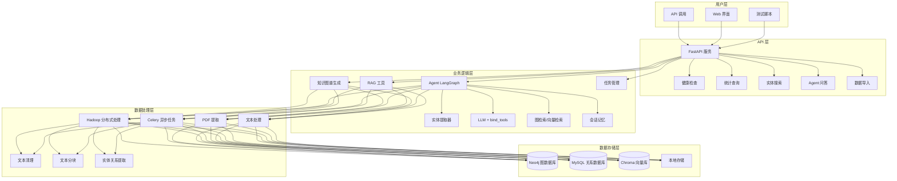
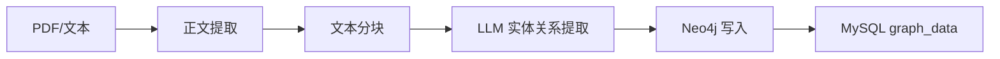
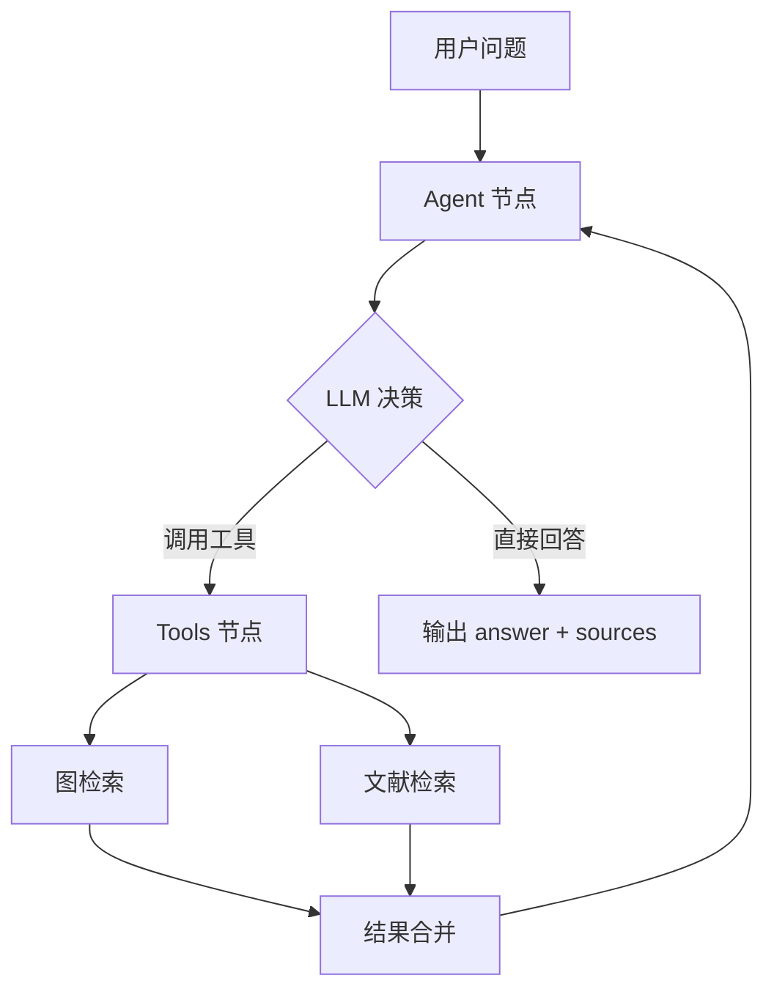
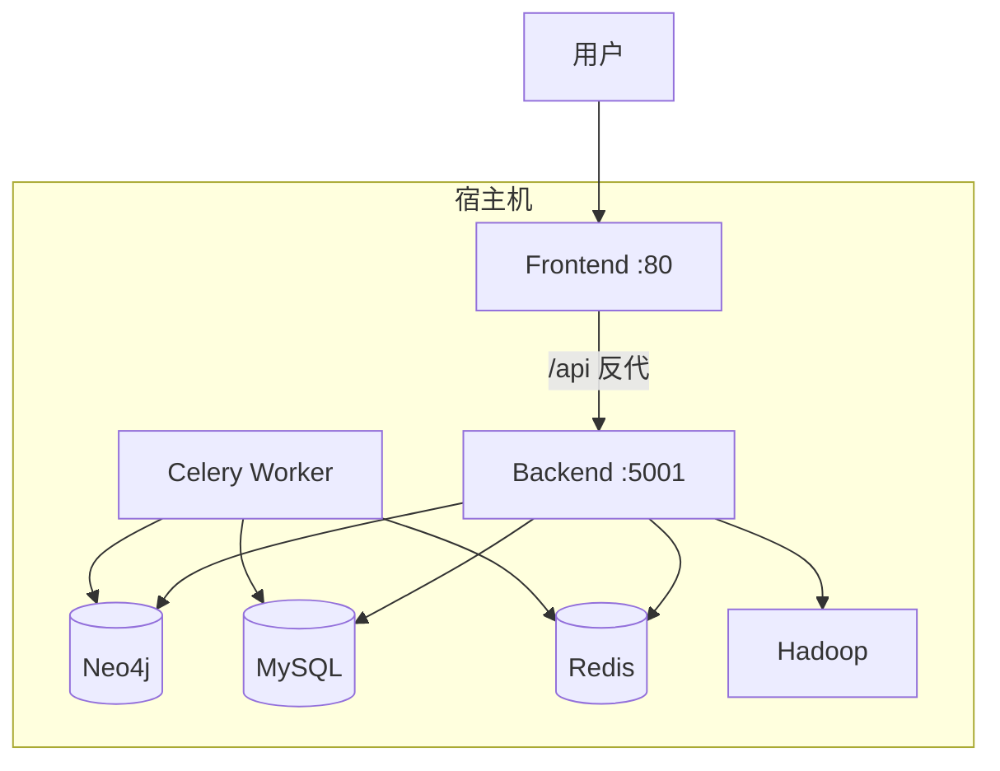

# 系统架构说明

本文档描述「胰明」知识图谱生成与智能问答系统的架构、数据流与技术栈。

---

## 一、整体架构

---

## 二、数据流

### 1. 知识图谱构建流程

### 2. Agent 智能问答流程

### 3. 部署拓扑（Docker Compose）

---

## 三、技术栈

| 层级     | 技术           | 说明                    |
|----------|----------------|-------------------------|
| 前端     | Vue 2 + Element UI | Web 界面、图谱可视化 |
| API      | FastAPI        | RESTful 接口、OpenAPI   |
| 业务     | LangGraph Agent | 智能问答编排            |
| RAG      | 图检索 + Chroma | 图谱与文献检索          |
| 任务     | Celery + Redis | 异步任务队列            |
| 分布式   | Hadoop         | 大规模文本处理          |
| 图数据库 | Neo4j          | 知识图谱存储            |
| 关系库   | MySQL          | 元数据、历史、用户      |
| 向量库   | Chroma         | 文档嵌入与检索          |
| LLM      | DeepSeek 等    | 多模型支持              |

---

## 四、相关文档

- **API 接口**：`docs/API.md`，或启动后访问 `/docs`
- **部署说明**：`docs/DEPLOYMENT.md`
- **演示脚本**：`docs/DEMO_SCRIPT.md`
